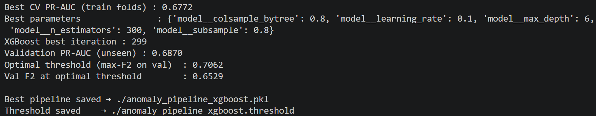
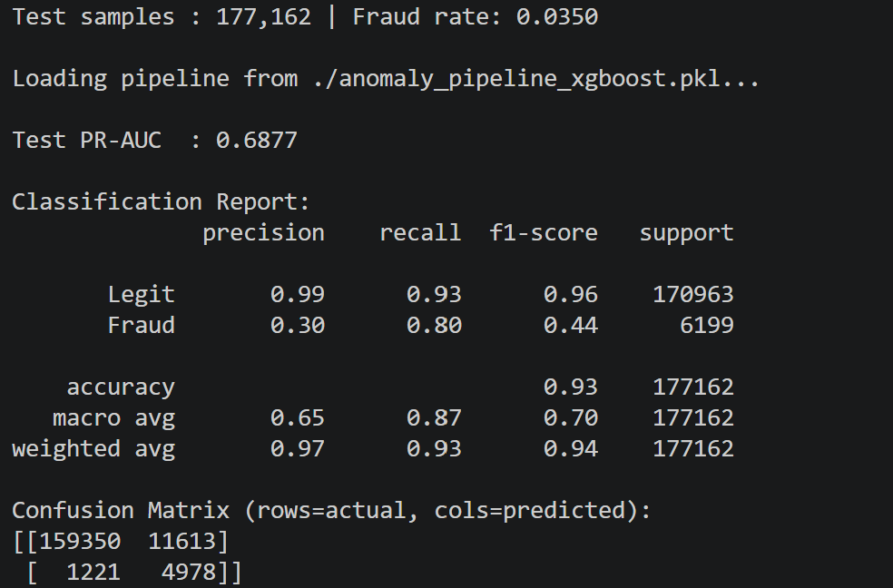
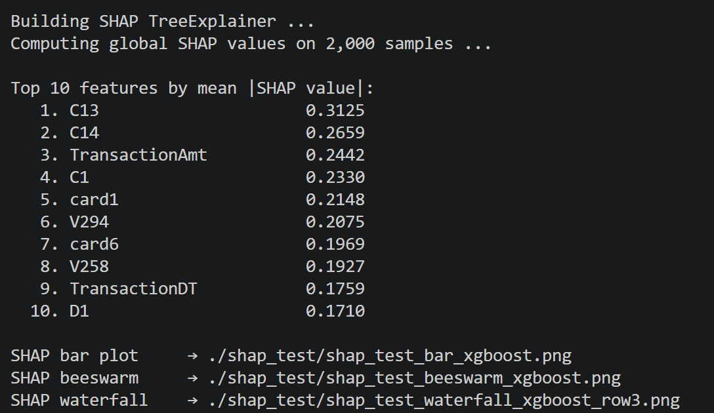
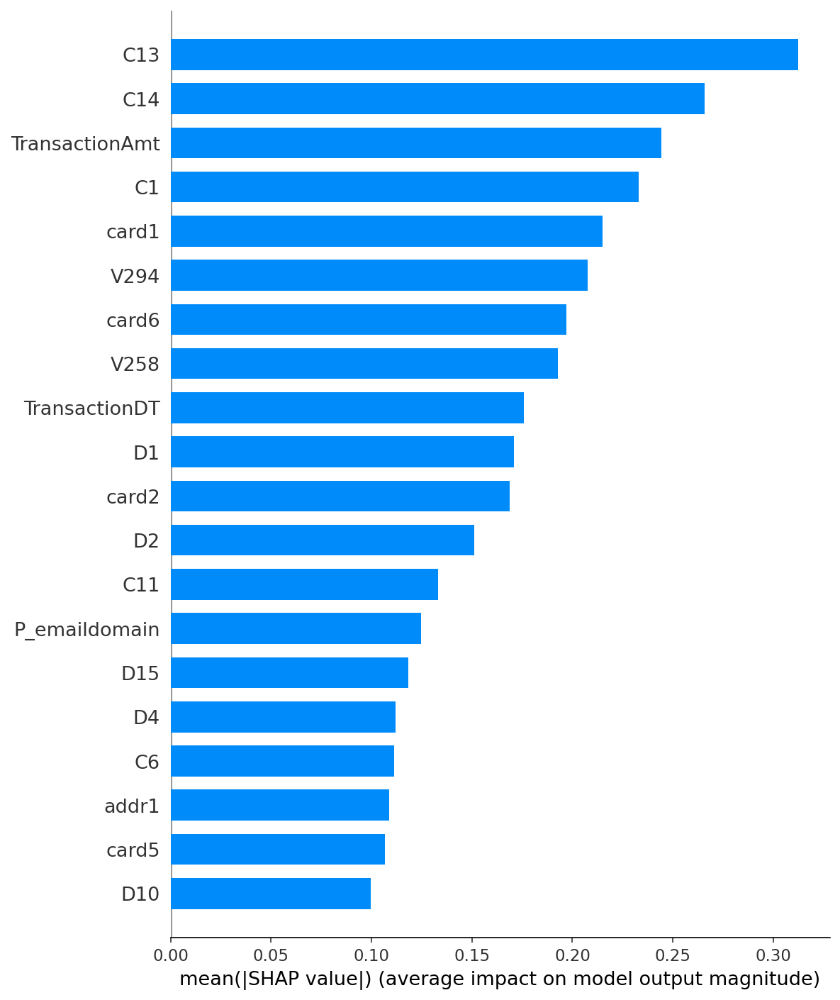
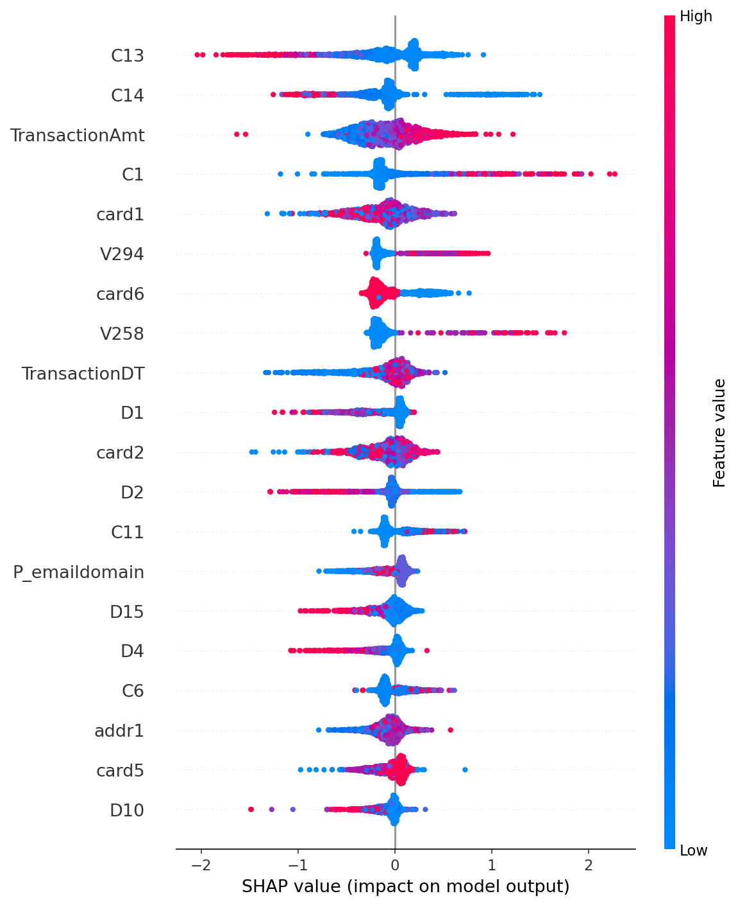
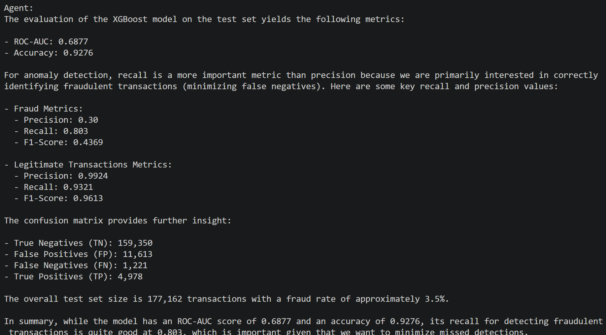
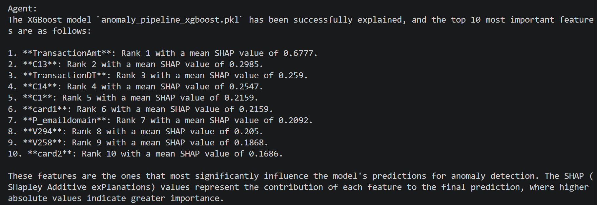

# IEEE AI Credit Risk Project — Fraud Detection Pipeline


An end-to-end, production-grade fraud detection system built on the [IEEE-CIS Fraud Detection Dataset](https://www.kaggle.com/competitions/ieee-fraud-detection/data) (~590K transactions). Covers the full MLOps lifecycle: feature engineering → model training → threshold optimisation → explainability → AI-agent-driven inference via a local LLM and MCP server. Feature engineering was obtained by [IEEE Fraud Feature Selection (RFECV)](https://www.kaggle.com/code/pavelvpster/ieee-fraud-feature-selection-rfecv/notebook).

---

## Business Value

Credit card fraud costs the global financial industry **over $32 billion annually**. Traditional rule-based systems fail to adapt to novel fraud patterns and generate excessive false positives — blocking legitimate customers and eroding trust.

This system addresses that directly:

| Business Outcome | How It's Delivered |
|---|---|
| **Fewer missed frauds** | F2-score threshold optimisation weights recall 2× over precision, so the model is tuned to catch fraud first — not just maximise accuracy |
| **Lower false-positive rate** | Adjustable decision threshold lets risk teams dial between aggressive fraud capture and customer experience without retraining the model |
| **Regulatory compliance** | Per-transaction SHAP waterfall plots provide a ranked, human-readable explanation for explainable automated decisions |
| **Faster analyst workflows** | Plain-English queries via the AI agent replace manual script execution — fraud analysts get answers without needing to touch code |
| **Data stays on-premises** | The AI agent runs on a local `qwen2.5:7b` LLM with no cloud API calls, ensuring sensitive transaction data never leaves the institution's environment |
| **Rapid deployment** | A single CLI command covers ingestion → preprocessing → training → evaluation → scoring, reducing model deployment time from weeks to hours |

### Who Benefits

| Stakeholder | Value |
|---|---|
| **Risk & Fraud Teams** | Actionable flags with per-transaction explanations replace opaque score outputs |
| **Compliance Officers** | SHAP audit trails and threshold JSON files support model governance documentation |
| **Data Scientists** | Modular, swappable model backends (XGBoost / Random Forest) with full test coverage accelerate experimentation |
| **Engineering Teams** | MCP server exposes all pipeline stages as versioned tools, making integration into existing fraud infrastructure straightforward |

---

## Project Highlights

- **Handles extreme class imbalance (~3.5% fraud)** — XGBoost uses `scale_pos_weight` for in-gradient correction; Random Forest uses SMOTE + `class_weight='balanced'`; stratified splitting preserves fraud rate across all three splits
- **Dual model backends** — GPU-accelerated XGBoost (`tree_method=hist`, CUDA) and CPU-based Random Forest; 5-fold `StratifiedKFold` GridSearchCV with `average_precision` scoring across up to 24 hyperparameter combinations
- **F2-score threshold optimisation** — Precision–recall curve on the validation set selects the cutoff that maximises F2 (β=2), weighting recall 2× over precision to minimise missed fraud — the correct business objective
- **Compliance-ready explainability** — SHAP `TreeExplainer` generates global bar/beeswarm plots and per-transaction waterfall plots; every flagged transaction gets a ranked list of feature drivers for audit and regulatory review
- **Conversational AI agent** — 7-tool MCP server exposes the full pipeline; a local `qwen2.5:7b` (7B-parameter) Ollama agent translates plain-English queries into autonomous multi-step tool calls (up to 15 iterations) — no cloud data egress
- **81 automated tests** — Unit and integration suite across config, preprocessing, model factory, training, evaluation, and prediction; all runs print a coverage table

---

## Tech Stack

| Layer | Technologies |
|---|---|
| **ML / Modelling** | XGBoost 2.0+, scikit-learn 1.3+, imbalanced-learn (SMOTE) |
| **Explainability** | SHAP TreeExplainer — bar, beeswarm, and waterfall plots |
| **Data** | pandas, NumPy, log1p transforms, OrdinalEncoder, median imputation |
| **AI Agent** | Ollama (`qwen2.5:7b`), MCP (FastMCP / SSE), OpenAI-compatible tool calling |
| **Persistence** | joblib (model .pkl), JSON (threshold), YAML (hyperparameter grids) |
| **Testing** | pytest, pytest-cov (unit + integration, 81 tests) |
| **Hardware** | CUDA GPU (XGBoost training), CPU (Random Forest + inference) |

---

## System Architecture

```
┌──────────────────────────────────────────────────────────┐
│                        Data Layer                        │
│  train_with_features_target.csv  ➜  60 / 10 / 30 split  │
│  76 features · 63 numerical · 13 categorical             │
└─────────────────────┬────────────────────────────────────┘
                      │
┌─────────────────────▼────────────────────────────────────┐
│               Preprocessing Pipeline                     │
│  log1p(TransactionAmt) → median impute → OrdinalEncode   │
└─────────────────────┬────────────────────────────────────┘
                      │
┌─────────────────────▼────────────────────────────────────┐
│                   Model Training                         │
│  ┌──────────────────────┐  ┌────────────────────────┐   │
│  │  XGBoost  (GPU)      │  │  Random Forest (CPU)   │   │
│  │  scale_pos_weight    │  │  SMOTE + balanced wts  │   │
│  │  GridSearchCV 5-fold │  │  GridSearchCV 5-fold   │   │
│  └──────────┬───────────┘  └───────────┬────────────┘   │
│             └──────────────┬───────────┘                 │
│                    F2 threshold opt.                     │
│              (PR-curve · validation set)                 │
└─────────────────────┬────────────────────────────────────┘
                      │
┌─────────────────────▼────────────────────────────────────┐
│             Evaluation & Explainability                  │
│  PR-AUC · Classification report · Confusion matrix       │
│  SHAP global (bar / beeswarm) + per-row (waterfall)      │
└─────────────────────┬────────────────────────────────────┘
                      │
┌─────────────────────▼────────────────────────────────────┐
│               AI Agent Interface                         │
│  Natural language query                                  │
│        ↓                                                 │
│  qwen2.5:7b (Ollama)  ←→  MCP Server (7 tools, SSE)     │
│        ↓                                                 │
│  Autonomous multi-step execution · max 15 iterations     │
└──────────────────────────────────────────────────────────┘
```

---

## Key Engineering Decisions

**Class imbalance** — XGBoost uses `scale_pos_weight` to embed imbalance correction directly into gradient updates, avoiding synthetic-sample artefacts. Random Forest pairs SMOTE with `class_weight='balanced'` because tree ensembles without gradient weighting benefit more from resampling.

**F2 over F1** — A missed fraud costs far more than a false alarm. Optimising the decision threshold for F2 (β=2) encodes that asymmetry directly into the model boundary rather than relying on a generic 0.5 cutoff.

**SHAP for compliance** — Financial regulators (SR 11-7, GDPR Article 22) require explainable automated decisions. Per-transaction SHAP waterfall plots deliver a ranked list of feature contributions for every flag, making the system audit-ready without post-hoc retrofitting.

**Local LLM + MCP** — Exposing the pipeline as MCP tools keeps the agent stateless and composable. Running `qwen2.5:7b` on-premises means transaction data never leaves the local environment — a hard requirement in most financial institutions.

---

## Run with Docker (no Python install)

If you'd rather not install Python, Ollama, or any Python packages, the project ships with a Docker setup that handles everything. The only tools required on the host machine are **Docker** and **git lfs**.

### Prerequisites

The Docker workflow needs only two things on the host machine:

| Tool | Purpose | Verify |
|---|---|---|
| **Docker** (with Compose v2) | Runs Ollama, the MCP server, and the project shell as containers | `docker --version && docker compose version` |
| **git lfs** | Pulls the model `.pkl` and the IEEE dataset CSVs (tracked via Git LFS) | `git lfs version` |

No Python, no Ollama, no CUDA driver, and no Python packages are required on the host — everything ships inside the container images.

#### System requirements

| Resource    | Minimum            | Comfortable         |
| ----------- | ------------------ | ------------------- |
| RAM         | 8 GB               | 16 GB               |
| Disk free   | 10 GB              | 20 GB               |
| CPU         | x86_64 or ARM64    | Same                |
| GPU         | Not required       | NVIDIA optional     |
| OS          | Linux / macOS / Windows (with WSL2) | Same |
| Network     | Internet on first run | Same             |

The default agent LLM is `qwen2.5:3b` (~2 GB), chosen so the project runs on 8 GB laptops. To use the larger `qwen2.5:7b`, set `OLLAMA_MODEL=qwen2.5:7b` before `docker compose up`.

#### Install Docker (one-time)

**Linux (Ubuntu / Debian / most distros)**
```bash
curl -fsSL https://get.docker.com | sh
sudo usermod -aG docker $USER
sudo systemctl enable --now docker
# log out and back in (or run `newgrp docker`)
docker --version && docker compose version
```

**macOS**
```bash
# Homebrew route (recommended)
/bin/bash -c "$(curl -fsSL https://raw.githubusercontent.com/Homebrew/install/HEAD/install.sh)"
brew install --cask docker
open -a Docker
docker --version && docker compose version
```

**Windows** — install Docker Desktop from <https://www.docker.com/products/docker-desktop>; it sets up WSL2 integration automatically.

### Run the project

```bash
# 1. Get the code and the data
git lfs install
git clone <repo-url>
cd IEEEAICreditRiskProject
git lfs pull

# 2. Start the background services (Ollama + MCP server)
docker compose up -d
```

When you're done:
```bash
docker compose down  # stop Ollama + MCP
```

The pulled Ollama models persist in the `ollama-data` named volume, so subsequent `docker compose up` calls are fast.

### MCP Server (Docker)

The `docker compose up -d` step in [Run the project](#run-the-project) already starts the MCP server as a long-running container — there is no separate command to run. The server listens on the Compose network at `http://mcp:8000/sse`, which the `agent` service picks up via the `MCP_URL` environment variable.

```bash
# Confirm the MCP server is up
docker compose ps mcp

# Tail the server logs (Ctrl-C to stop following)
docker compose logs -f mcp

# Restart only the MCP server (e.g. after editing credit_risk/server/mcp_server.py)
docker compose restart mcp

# Run the server in the foreground for debugging (Ctrl-C to stop)
docker compose run --rm --service-ports mcp
```

### AI Agent (Docker)

Run any agent query through the `agent` service — the MCP server and Ollama are already running from `docker compose up -d`. The `agent` service sits behind the `agent` profile so it only runs on demand, and its entrypoint is already `python -m credit_risk.agent.agent`, so anything after `agent` on the command line is forwarded as CLI arguments.

```bash
# Train
docker compose --profile agent run --rm agent --query "Split the dataset and train XGBoost in fast mode"

# Evaluate
docker compose --profile agent run --rm agent --query "Evaluate the XGBoost model on the test set"

docker compose --profile agent run --rm agent --query "Show the confusion matrix and anomaly precision/recall for XGBoost"

docker compose --profile agent run --rm agent --query "Explain the XGBoost model and show the top 10 most important features"

# Predict
docker compose --profile agent run --rm agent --query "Score transactions in predict_without_target.csv using XGBoost"

docker compose --profile agent run --rm agent --query "Score predict_without_target.csv with a threshold of 0.3"
```

---

## Prerequisites

> The steps below are only needed if you're running the project natively (without Docker). If you used the Docker workflow above, you can skip ahead to [Pipeline](#pipeline).

### 1. Create and activate a Python virtual environment

> Python 3.10 or higher is required.

```bash
# Create the environment
python -m venv myenv

# Activate — macOS / Linux
source myenv/bin/activate

# Activate — Windows (Command Prompt)
myenv\Scripts\activate.bat

# Activate — Windows (PowerShell)
myenv\Scripts\Activate.ps1
```

Keep the environment active for all subsequent steps. Your prompt will show `(myenv)` when it is active.

### 2. Install dependencies

**Option A — editable package install (recommended)**
```bash
pip install -e .
```
Installs the `credit_risk` package for use with `python -m`.

**Option B — plain requirements**
```bash
pip install -r requirements.txt
```

### 3. Start Ollama in the terminal (required for the AI agent only)
```bash
ollama serve
ollama pull qwen2.5:7b
```

---

## Package Structure

```
credit_risk/
├── config/
│   ├── features.py        # selected / numerical / categorical feature lists
│   └── constants.py       # file names, get_paths(), base_parser()
├── data/
│   └── preprocessing.py   # split_and_save, apply_log_transforms, build_preprocessor
├── models/
│   └── factory.py         # get_model_and_grid (XGBoost / RF)
├── explainability/
│   └── shap_utils.py      # _fraud_shap helper
├── pipeline/
│   ├── train.py           # train()  — python -m credit_risk.pipeline.train
│   ├── evaluate.py        # test(), run_shap()  — python -m credit_risk.pipeline.evaluate
│   └── predict.py         # predict()  — python -m credit_risk.pipeline.predict
├── server/
│   └── mcp_server.py      # FastMCP server  — python -m credit_risk.server.mcp_server
└── agent/
    └── agent.py           # Ollama agent  — python -m credit_risk.agent.agent
```

Import anything directly:
```python
from credit_risk.pipeline.train import train
from credit_risk.config.features import selected_features
```

---

## Required Data Files

Place the following files in your `--data_dir` folder before running the pipeline:

| File | Used by | Notes |
|---|---|---|
| `train_with_features_target.csv` | Stage 1 — Train | Built from the IEEE Fraud Detection Dataset. Must already contain the selected feature columns (see `credit_risk/config/features.py`) plus the `isFraud` target column — this code does **not** perform feature selection. |
| `predict_without_target.csv` | Stage 3 — Predict | New transactions to score. Must contain the same feature columns as the training file, without `isFraud`. |

---

## Pipeline

### Stage 1 — Train

```bash
# Full grid search (~30-90 min)
python -m credit_risk.pipeline.train --data_dir .

# Fast mode — one-combo grid search (~5 min)
python -m credit_risk.pipeline.train --data_dir . --fast_mode

# Retrain without re-splitting (reuse existing CSVs)
python -m credit_risk.pipeline.train --data_dir . --skip_split --fast_mode

# Train Random Forest instead (CPU only, no GPU required)
python -m credit_risk.pipeline.train --data_dir . --model rf
```

| Flag | Default | Effect |
|---|---|---|
| `--data_dir` | *(required)* | Folder containing CSVs and where models are saved |
| `--model` | `xgboost` | `xgboost` or `rf` |
| `--fast_mode` | off | One-combo grid search (~5 min) instead of full search |
| `--skip_split` | off | Reuse existing `train_split.csv` / `val_split.csv` / `test_split.csv` |

Produces:
- `anomaly_pipeline_<model>.pkl` — trained pipeline
- `anomaly_pipeline_<model>.threshold` — optimal F2 threshold from validation

### Query response: XGBoost fast mode

---


### Stage 2 — Evaluate

```bash
# Full evaluation report on the held-out test set
python -m credit_risk.pipeline.evaluate --data_dir . --model xgboost

# With SHAP global feature importance plots saved to ./shap_test/
python -m credit_risk.pipeline.evaluate --data_dir . --model xgboost --explain

# SHAP with more samples and a custom output directory
python -m credit_risk.pipeline.evaluate --data_dir . --model xgboost --explain --n_global 5000 --output_dir ./my_plots
```

| Flag | Default | Effect |
|---|---|---|
| `--data_dir` | *(required)* | Folder containing `test_split.csv` and the model `.pkl` |
| `--model` | `xgboost` | `xgboost` or `rf` |
| `--explain` | off | Generate SHAP bar, beeswarm, and waterfall plots |
| `--n_global` | `2000` | Samples used for global SHAP plots (fewer = faster) |
| `--output_dir` | `<data_dir>/shap_test/` | Where SHAP PNGs are saved |

Outputs: PR-AUC, classification report (precision / recall / F1), confusion matrix.

### Query response: XGBoost fast mode evaluation




### Query response: XGBoost fast mode SHAP graphs




### Stage 3 — Predict

```bash
# Score new transactions
python -m credit_risk.pipeline.predict \
  --model_path ./anomaly_pipeline_xgboost.pkl \
  --input      ./predict_without_target.csv \
  --output     predictions.csv

# Override threshold (lower = catches more anomalies, higher false-positive rate)
python -m credit_risk.pipeline.predict \
  --model_path ./anomaly_pipeline_xgboost.pkl \
  --input      ./predict_without_target.csv \
  --output     predictions.csv \
  --threshold  0.3

# Score and generate SHAP waterfall plots for the top 5 flagged transactions
python -m credit_risk.pipeline.predict \
  --model_path ./anomaly_pipeline_xgboost.pkl \
  --input      ./predict_without_target.csv \
  --output     predictions.csv \
  --explain --n_explain 5
```

| Flag | Default | Effect |
|---|---|---|
| `--model_path` | *(required)* | Path to the `.pkl` pipeline file |
| `--input` | *(required)* | CSV of new transactions to score |
| `--output` | `predictions.csv` | Path for the output CSV |
| `--threshold` | *(auto)* | Anomaly cutoff; if omitted, loads from `.threshold` file (falls back to `0.5`) |
| `--explain` | off | Generate SHAP waterfall plots for flagged rows |
| `--n_explain` | `5` | How many flagged rows get waterfall plots |

Output CSV adds two columns to the input: `anomaly_probability` and `anomaly_flag`.

## MCP Server

The MCP server exposes all pipeline stages as tools that the AI agent calls in another terminal.

```bash
# Start the server (keep running in a dedicated terminal)
python -m credit_risk.server.mcp_server
```

### Available tools

| Tool | Description | Key Parameters |
|---|---|---|
| `split_dataset` | Stratified 60/10/30 train/val/test split | `data_dir` |
| `train_model` | GridSearchCV + SMOTE training | `model_name`, `fast_mode` |
| `evaluate_model` | Full test-set evaluation report | `model_name` |
| `predict_transactions` | Score new transactions for anomalies | `input_csv`, `threshold` |
| `explain_model` | SHAP global feature importance | `model_name`, `n_samples` |
| `get_feature_config` | Returns the full feature schema | — |
| `list_models` | Lists saved `.pkl` model files | `data_dir` |

---

## AI Agent

The agent translates natural language into MCP tool calls in another terminal. The MCP server must be running first (see [MCP Server](#mcp-server) below).

```bash
# Train
python -m credit_risk.agent.agent --query "Split the dataset and train XGBoost in fast mode"
python -m credit_risk.agent.agent --query "Train a Random Forest model"

# Evaluate
python -m credit_risk.agent.agent --query "Evaluate the XGBoost model on the test set"
python -m credit_risk.agent.agent --query "What is the ROC-AUC of the XGBoost model?"
python -m credit_risk.agent.agent --query "Show the confusion matrix and anomaly precision/recall for XGBoost"
python -m credit_risk.agent.agent --query "Explain the XGBoost model and show the top 10 most important features"

# Predict
python -m credit_risk.agent.agent --query "Score transactions in predict_without_target.csv using XGBoost"
python -m credit_risk.agent.agent --query "Score predict_without_target.csv with a threshold of 0.3"
```

### Agent response: XGBoost model on the test set


### Agent response: XGBoost model explainability


---

## Running Tests

```bash
# Full test suite (unit + integration)
python -m pytest

# Unit tests only (~2 s)
python -m pytest tests/unit/

# Integration tests only (~15 s — trains a small model)
python -m pytest tests/integration/

# Single file or test
python -m pytest tests/unit/test_factory.py
python -m pytest tests/unit/test_factory.py::test_unknown_model_class_raises_value_error
```

| Flag | Effect |
|---|---|
| `-v` | Verbose — prints every test name |
| `-x` | Stop on the first failure |
| `--tb=short` | Shorter tracebacks on failure |
| `-q` | Quiet — minimal output |

Every run automatically prints a coverage table (configured in `pytest.ini`).

```
tests/
├── unit/
│   ├── test_config_constants.py   # get_paths, base_parser
│   ├── test_config_loader.py      # load_config, caching, YAML structure
│   ├── test_factory.py            # get_model_and_grid (XGBoost / RF)
│   ├── test_features.py           # feature list counts and disjointness
│   ├── test_log.py                # JSON logger output
│   └── test_preprocessing.py     # log transform, imputer, build_preprocessor
└── integration/
    ├── test_split.py              # split_and_save — file creation, row counts, stratification
    ├── test_train.py              # train() — pkl output, threshold JSON, RF path, edge cases
    ├── test_evaluate.py           # test() — metrics structure and ranges
    └── test_predict.py            # predict() — output CSV, threshold, edge cases
```

---

## Reference

### Models

| Model | Backend | Best for |
|---|---|---|
| `xgboost` | GPU-accelerated (CUDA) | Best accuracy, faster training on GPU |
| `rf` | CPU (Random Forest) | No GPU required, balanced class weights |

### Output Files

| File / Directory | Created by | Contents |
|---|---|---|
| `anomaly_pipeline_xgboost.pkl` | `train_model` | Trained XGBoost pipeline |
| `anomaly_pipeline_rf.pkl` | `train_model` | Trained Random Forest pipeline |
| `anomaly_pipeline_<model>.threshold` | `train_model` | Optimal threshold JSON (max-F2 on val) |
| `train_split.csv` | `split_dataset` | 60% training rows |
| `val_split.csv` | `split_dataset` | 10% validation rows |
| `test_split.csv` | `split_dataset` | 30% held-out test rows |
| `predictions.csv` | `predict_transactions` | Input rows + `anomaly_probability` + `anomaly_flag` |
| `shap_test/` | `evaluate --explain` | Bar, beeswarm, waterfall PNGs |
| `shap_agent/` | `explain_model` tool | Bar, beeswarm, waterfall PNGs |
| `predictions_shap/` | `predict --explain` | Per-flagged-row waterfall PNGs |
